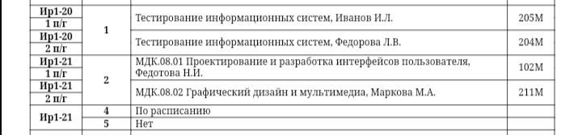
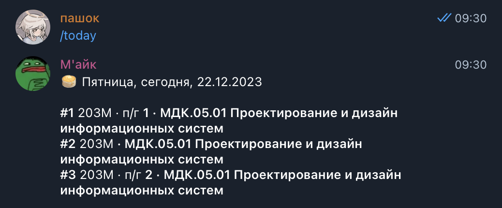

## TL;DR
Дело было вечером, делать было нечего. \
Было крайне неудобно иметь такое расписание *(ни уведомлений, ни адаптации под мобильные экраны, ни стабильной работы самого сайта)* в шараге, поэтому я сделал бота в телеграме, который умеет его парсить, сравнивать и присылать уведомление об изменениях.

<p align="center">
  Таким образом, вот это:
  
  Превратилось в это:
  
</p>

На данный момент работает только в пределах 4 корпуса.
___

## Сборка
Сложности возникают разве что с sqlx и его проверкой sql-запросов. Решается указанием `DATABASE_URL` или `SQLX_OFFLINE 1`.

> Для `maiq-bot` необходимо указать `TELOXIDE_TOKEN` \
> Для `maiq-db` необходимо указать `SQLITE_PATH`. `DATABASE_URL` использует sqlx для проверки запросов и не обязателен для билда, но тогда надо указать `SQLX_OFFLINE 1`, а `SQLITE_PATH` - реальный файл .sqlite

docker
```sh
docker build -t maiq-bot .
docker run -v <PATH>:/var/sqlite.db -e RUST_LOG=info -e RUST_LOG_STYLE=always -e SQLITE_PATH=/var/sqlite.db -e TELOXIDE_TOKEN=<token> -dit maiq-bot
```

## Архитектура

**maiq-parser** \
Содержит в себе определения структур для таблицы расписания (`Snapshot` -> `Group` -> `Lecture`), парсер html-таблицы и парсером данных из этой таблицы.

**maiq-db** \
Слой для работы с базой данных. Втупую сохраняет и выдаёт данные из sqlite.

**maiq-bot** \
Использует оба вышеописанных крейта для работы, представляет собой бота в телеге, который может реагировать на команды/callback-query, сохранять группы пользователя и отправлять ему уведомления. \
В директории `maiq-bot/replies` хранятся темплейты для ответов бота.

**maiq-cli** \
Бесполезная штука, которая изначально планировалась, как cli-утилита для вывода расписания, но разве это кому-то надо?

В директории `.changes` находится человекочитаемый лог изменений, `maiq-bot` умеет его отображать.

## Contributing
В необходимости этой секции я сомневаюсь ещё больше, чем в необходимости существования `maiq-cli`, но тем не менее приглашаю в [issues](https://github.com/pashokitsme/maiq-parser-next/issues) и [pull requests](https://github.com/pashokitsme/maiq-parser-next/pulls), все остальные вопросы - в [телегу](https://t.me/pashokitsme)

## Предыдущие версии
Изначально этот репозиторий был разделён на три - [maiq-web-api](https://github.com/pashokitme/maiq-web-api), [maiq-parser](https://github.com/pashokitsme/maiq-parser) и [maiq-bot](https://github.com/pashokitsme/maiq-bot). Быстро выяснилось, что такая архитектура неудобная, нерасширяемая, громоздкая, ещё и кушает больше ресурсов. Переписал и теперь это монорепо, а эти трое - в архиве на память.